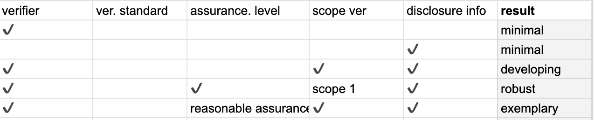

# Instructions

This small demo web application was built with [Remix Run](https://remix.run/docs), a NodeJS and ReactJS framework. To run it, make sure you have NodeJS version 18.x installed: https://nodejs.org/en/download.

Install the application's dependencies: 

```shellscript
npm install
```

Create a SQLite database to store submissions
```shellscript
npm run setup
```

You should now see a SQLite file under `app/data`.

Lastly run the application in its dev server: 

```shellscript
npm run dev
```

and navigate to `http://localhost:5173/app` in your browser to see the application.

## Notes

### Assumptions made: 

1. In the instructions, while only the verifier input was written as required, I made the assumption that the text sections for "verification standard" and "verifier" were also mandatory.
2. In "Scope Verified", it is listed to be a multiple choice question with two bullet points. The first one says "Scope 1 and/or 2", so I assumed this to be one option rather than two options or in other words, it is a multiple choice question with only two choices.
3. I simplified the scoring methodology based on a matrix I made, which was further based on my understanding of the scoring methodology. This made it seem that the verification standard was not entirely necessary for the scoring (but perhaps for our verification sake).



#### About the code

Most of the important code lies in the `app.tsx` file, which is a React file. The `action` method contains the scoring methodology and database saving code (hence, "action"). The `loader` method contains a simple method to **load** up data (to display). Lastly, in the `Index` method (component in React terminology) contains the markup for the form, which is further broken down into individual component blocks.
